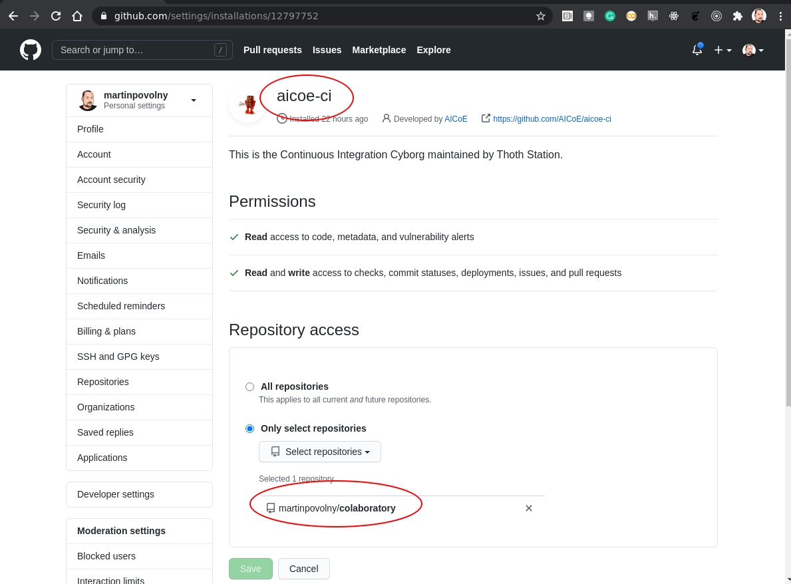
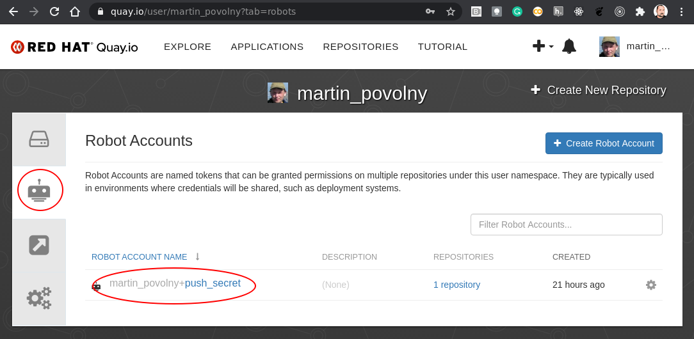
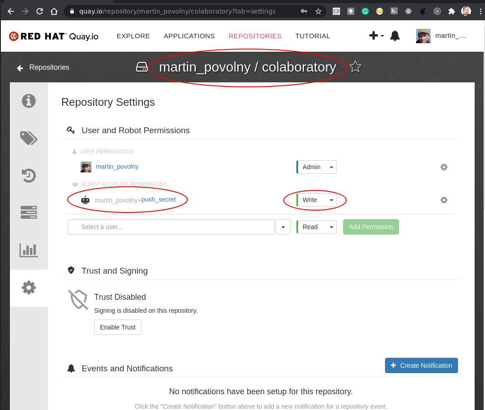
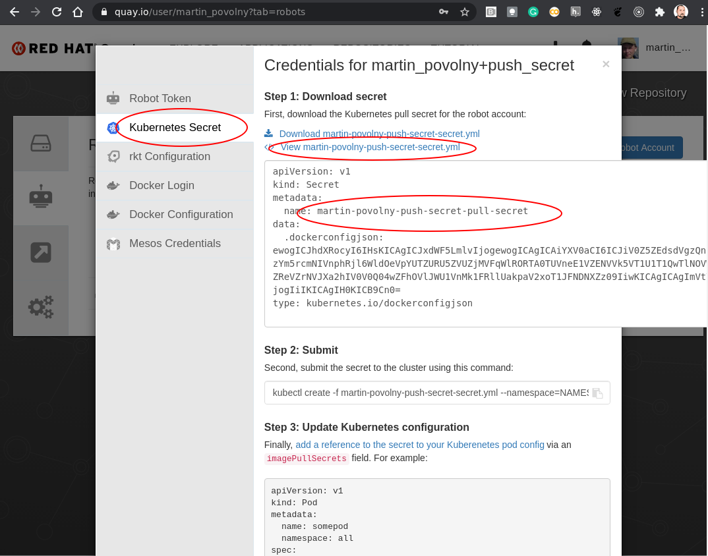
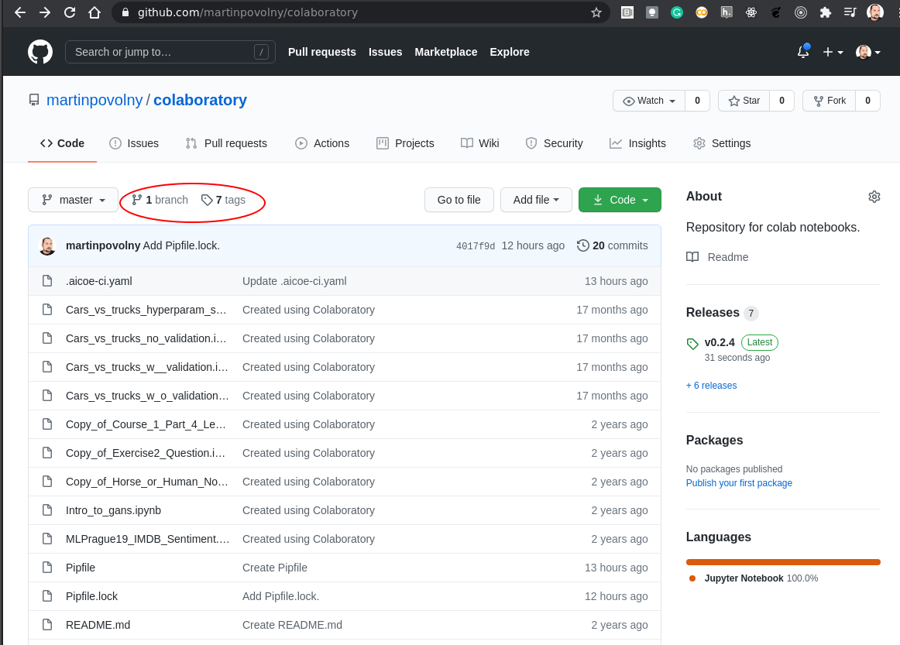
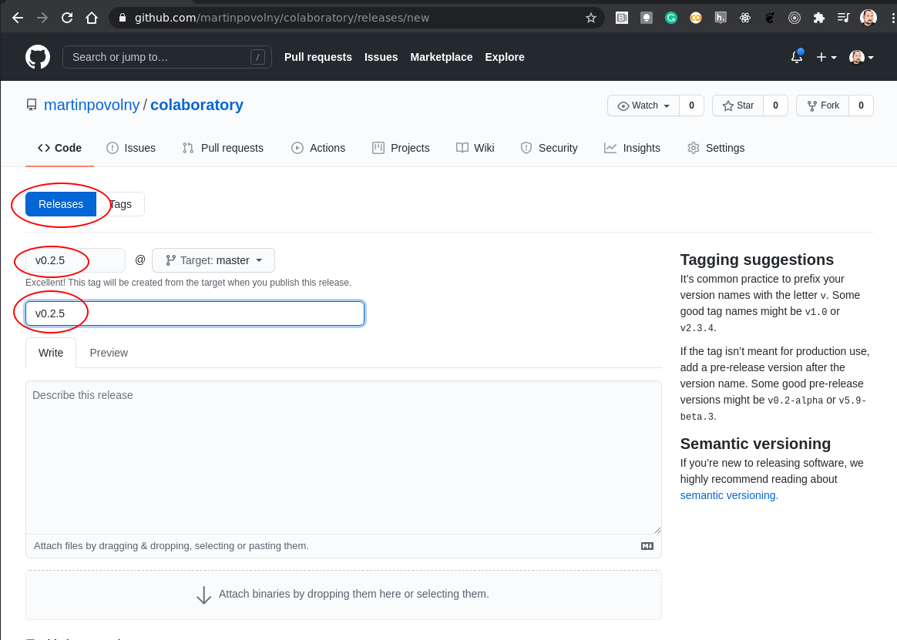
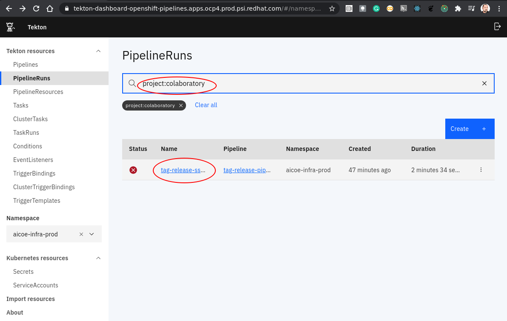

# How to create a JupyterHub image and deploy it on ODH

This how-to is about getting your repository built into an image and having that image made available in (your) JupyterHub instance.

We are going to deal with 2 issues:

 1. Build an image and add to a public image repository.
 2. Add your image to an ODH instance (that has a JupyterHub in it).

If you want to see a video walkthrough of this guide with an example project, please check out the video below:

`video: https://www.youtube.com/watch?v=R61i15hb4B0&feature=youtu.be`

If you don't have an ODH instance that you would like to work with, you can create one using these guides:

https://github.com/operate-first/continuous-deployment/tree/master/docs

## Build an image

If your image is not yet built, you can use [Thoth](https://thoth-station.ninja/) to do it for you using a config file in your repo.

Here's an example that goes together with the above example of an ImageStream:

https://github.com/aicoe-aiops/categorical-encoding/blob/master/.aicoe-ci.yaml

I am going to compile this into a guide and would be grateful for your testing of the process or improvement suggestions.

Information on enabling Thoth on your repo is here: https://github.com/AICoE/aicoe-ci#setting-aicoe-ci-on-github-organizationrepository

For 3rd party projects outside of the AICoE, one should change the value of `registry-org` (quay.io org) to his own value.

### Steps to have your notebook repo build into an image by Thoth

### Enable the CI integration

To get image built by Thoth (in Tekton?) (not sure what is the right formulation here) and uploaded to quay.io (image registry) one needs to add the "aicoe-ci" app to the project:



If your project is under the `aicoe-aiops` (and some other) GH orgs then this is already done on the org level and you don't need to do this step.

### Setting up the image repository

Next you need to have a place to upload the built images. For that you need an account and a project on quay.io.

Again there already exists an 'AICoE' organization in Quay: https://quay.io/organization/aicoe so if your project is part of AICoE you can use that.

Thoth needs to be able to access your project -- push images into it. That can be accomplished by creating a robot account with a push (pull) secret.

There are pre-configured push secrets for various projects already present in Thoth. See the bottom of this page: https://github.com/AICoE/aicoe-ci#services-and-features.

If your project is in one of these, you can skip this step.




After creating the robot you need to set the permissions it will possess.



And finally, you need to copy the secret and give it to Thoth. Copy the secret here:



This is currently a manual process so just, please, send the secret (the whole yaml) to @harshad16 to have it added.

Remember, this is only if you actually need new push secret. That is if Thoth does not have it already preconfigured.

### Adding configuration file to your repo

Next we need to finish configuration of the source repo. This is done by adding a config file named `.aicoe-ci.yaml`.


Here's an example of a working minimal config: https://github.com/aicoe-aiops/project-template/blob/master/.aicoe-ci.yaml

Uncomment the `build` section to enable Thoth build.

The builder can do a number of things. To have the S2I correctly build these 2 lines are essential:

The important parts for building the image using S2I into a format expected by JH is:

```
  build-source-script: "image:///opt/app-root/builder"
  base-image: quay.io/thoth-station/s2i-custom-notebook:latest
```

Modify the lines in the `build` section:
```
  registry-org: aicoe
  registry-project: my_project
  registry-secret: aicoe-pusher-secret
```
to match the project and robot's push secret you have setup in Quay.


### Triggering the build

Once you have this in your repo. You can trigger the build by doing a release. This is something that will be done for you automatically if you are using the whole Thoth toolset. But for minimal working setup, you can create a release manually.





If you have done these steps correctly, Thoth will pick up your tag and run a image build for you.

## Checking and debugging the build

You can login to https://tekton.operate-first.cloud/#/namespaces/opf-ci-pipelines/pipelineruns and find your build by using the search field. Enter "project:<YOUR_REPO_NAME>".



The part that is relevant for image building is under "tag-release-run". There may by other sections that are red, but if this part is green the image was built and pushed. You can also check that on Quay.io.

# Adding the image where you need it

Once your image is built (check in Quay), you can use it in your instance of ODH.

## Creating an ImageStream

This is done using a manifest of type `ImageStream`.

Here is an example:
```yaml
  apiVersion: image.openshift.io/v1
  kind: ImageStream
  metadata:
    name: categorical-encoding-notebook
    labels:
      opendatahub.io/notebook-image: "true"
    annotations:
      opendatahub.io/notebook-image-url:
        "https://github.com/aicoe-aiops/categorical-encoding"
      opendatahub.io/notebook-image-name:
        "Categorical Encoding Notebook Image"
      opendatahub.io/notebook-image-desc:
        "Jupyter notebook image with categorical encoding examples"
  spec:
    lookupPolicy:
      local: true
    tags:
      - annotations:
          openshift.io/imported-from: quay.io/aicoe/categorical-encoding
        from:
          kind: DockerImage
          name: quay.io/aicoe/categorical-encoding:latest
        importPolicy:
          scheduled: true
        name: "latest"
  ```

The important part is:
```
  labels:
    opendatahub.io/notebook-image: "true"
```
This tells JupyterHub that it has to offer this particular image then creating an instance for it's users.

Depending on where you want to use your image, you have to place the manifest into the right place or load in into your project using `oc apply -f <image_file.yaml>`.

For example
 * If you want to add your image to Operate First, you need to add the `ImageStream` manifest to the correct path in this [repo](https://github.com/operate-first/apps):

    - in [kfdefs/base/jupyterhub/notebook-images](https://github.com/operate-first/apps/tree/master/kfdefs/base/jupyterhub/notebook-images) where `base` in the overlays concept means that this image will be applied to all instances/overlays that have JupyterHub. In this case you can open a similar [Pull Request](https://github.com/operate-first/apps/pull/411/files).

    - in [kfdefs/overlays](https://github.com/operate-first/apps/tree/master/kfdefs/overlays) you will find all instances maintained by ArgoCD and you can choose to add the image only to a specific instance/overlay and not to all. In this case you can open a similar [Pull Request](https://github.com/operate-first/apps/pull/1148/files) (e.g. if you need to add an image to `osc` overlay). NOTE: _`overlay` concept is used also to override manifests from `base`, for example if you want a different image version in a specific `overlay`._

 * If you need to add your image to the internal DH (ODH instance run by DH team), make a PR against the `production` branch here:
https://github.com/AICoE/idh-manifests/blob/production/jupyterhub/bases/custom-images/jupyterhub-custom-images.yaml


